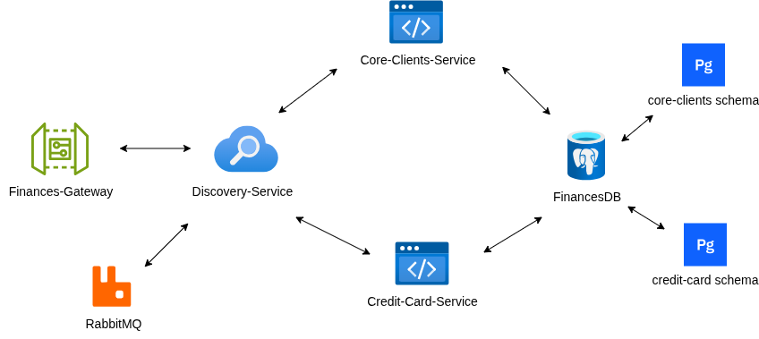

# finances-gateway

This is an API Gateway as a practical implementation of the microservices architecture. This is a Gateway MVC, based on serverlet stack. Other projects involved would be:

- [Discovery-Service](https://github.com/matheus-nicolau/dicovery-service)  
- [Credit-Card-Service](https://github.com/matheus-nicolau/credit-card-service)  
- [Core-Clients-Service](https://github.com/matheus-nicolau/core-clients-service)  
---
